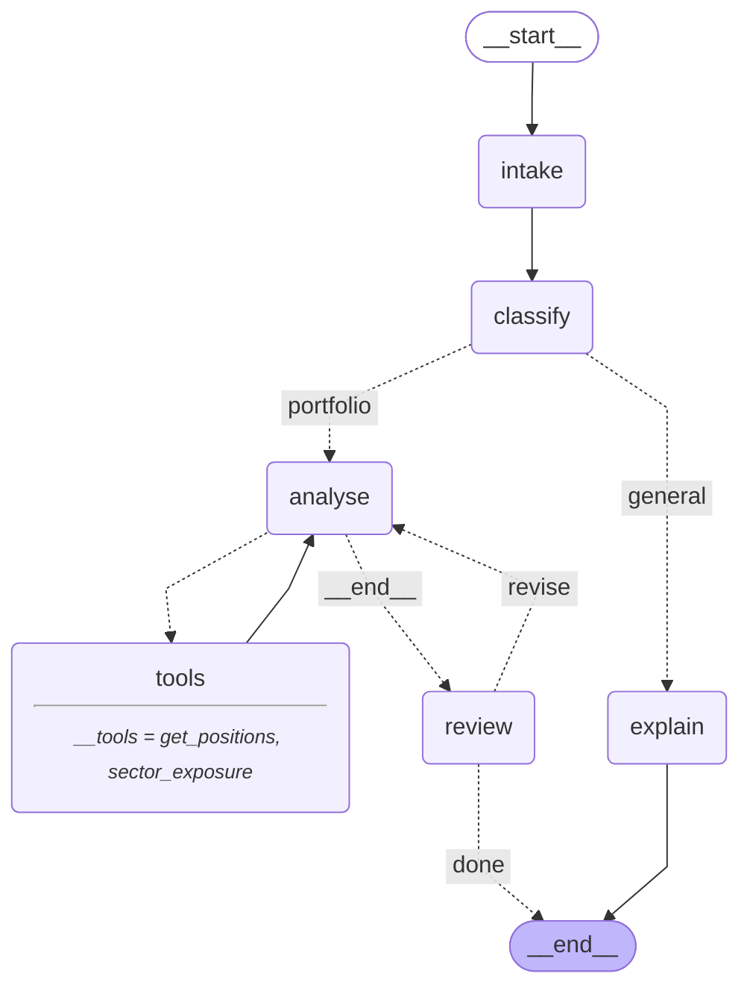

# The research graph

Generated from the code by `scripts/export_graph_diagram.py`. Do not edit by hand.

```mermaid
---
config:
  flowchart:
    curve: linear
---
graph TD;
	__start__([<p>__start__</p>]):::first
	intake(intake)
	classify(classify)
	analyse(analyse)
	tools(tools<hr/><small><em>__tools = get_positions, sector_exposure</em></small>)
	explain(explain)
	review(review)
	__end__([<p>__end__</p>]):::last
	__start__ --> intake;
	analyse -. &nbsp;__end__&nbsp; .-> review;
	analyse -.-> tools;
	classify -. &nbsp;portfolio&nbsp; .-> analyse;
	classify -. &nbsp;general&nbsp; .-> explain;
	intake --> classify;
	review -. &nbsp;done&nbsp; .-> __end__;
	review -. &nbsp;revise&nbsp; .-> analyse;
	tools --> analyse;
	explain --> __end__;
	classDef default fill:#f2f0ff,line-height:1.2
	classDef first fill-opacity:0
	classDef last fill:#bfb6fc
```
